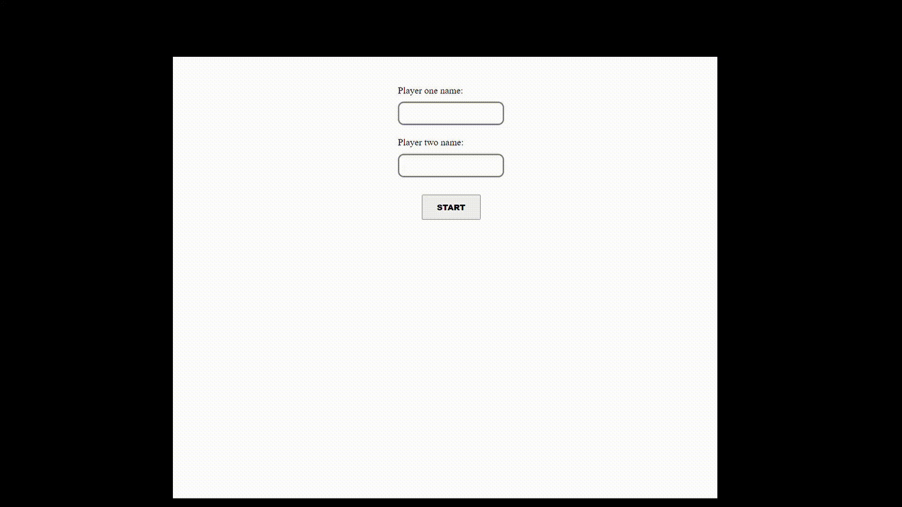

# Tic Tac Toe

[![Contributors][contributors-shield]][contributors-url]
[![Forks][forks-shield]][forks-url]
[![Stargazers][stars-shield]][stars-url]
[![Issues][issues-shield]][issues-url]

## About the project

JavaScript based basic Tic Tac Toe game.

## Demo

### [Live Demo Link](https://raw.githack.com/peterrobert/tic-tac-toe-javascript/feature-branch/index.html)

## Features

Some of the features on the projects include:

- Add User names before starting the game
- Default user names when applicable
- Basic Tic Tac Toe game logic.
- Game stops when winner is declared.

## Technologies Used

- This project utilizes the JavaScript and CSS Grid.

<!-- 

## Testing

## Test Output

-->

## Contributors

- Moin Khan
  - LinkedIn : [@MoinKhanIF](https://www.linkedin.com/in/moinkhanif/)
  - Personal Website: [MoinKhan.Info](https://moinkhan.info)
  - Twitter: [@MoinKhanIF](https://twitter.com/MoinKhanIF)
  
- Peter Robert
  - Github: [@peterrobert](https://github.com/peterrobert)
  - Twitter: [@ptahwambui93](https://twitter.com/Ptahwambui93)
  - LinkedIn: [Peter Robert Ndungu](https://www.linkedin.com/in/peter-rob-ndungu/)

<!-- MARKDOWN LINKS & IMAGES -->

[contributors-shield]: https://img.shields.io/github/contributors/peterrobert/tic-tac-toe-javascript.svg?style=flat-square
[contributors-url]: https://github.com/peterrobert/tic-tac-toe-javascript/graphs/contributors
[forks-shield]: https://img.shields.io/github/forks/peterrobert/tic-tac-toe-javascript.svg?style=flat-square
[forks-url]: https://github.com/peterrobert/tic-tac-toe-javascript/network/members
[stars-shield]: https://img.shields.io/github/stars/peterrobert/tic-tac-toe-javascript.svg?style=flat-square
[stars-url]: https://github.com/peterrobert/tic-tac-toe-javascript/stargazers
[issues-shield]: https://img.shields.io/github/issues/peterrobert/tic-tac-toe-javascript.svg?style=flat-square
[issues-url]: https://github.com/peterrobert/tic-tac-toe-javascript/issues
